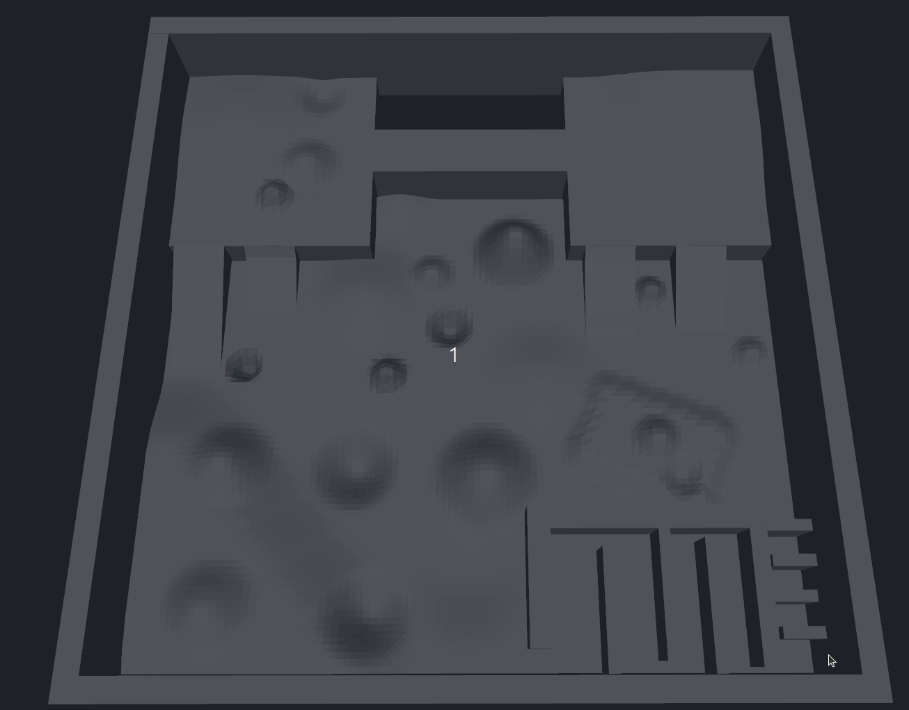
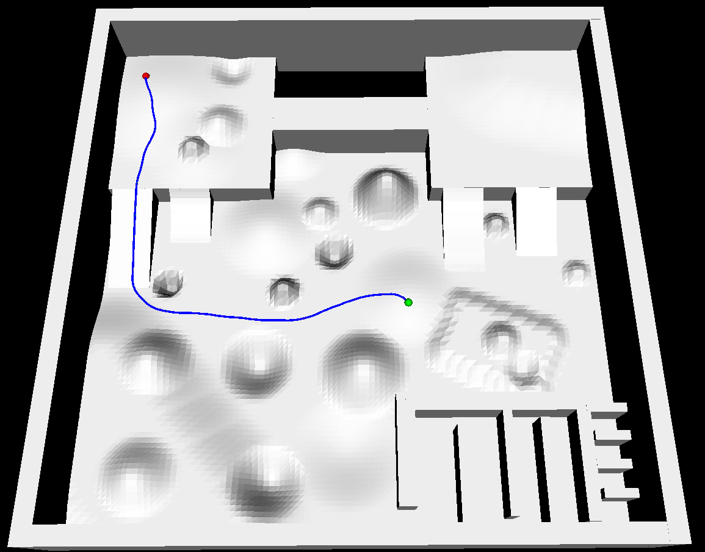
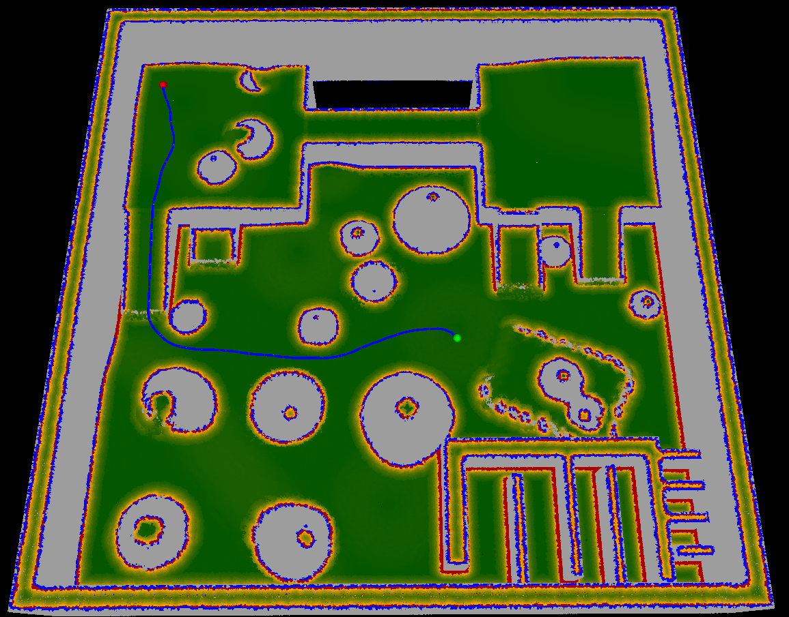
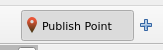

# Traversability Estimation
A ROS2 package for estimating traversability on pointclouds and 3D path planning for ground robots.







# Building
Use docker to build the package:
```bash
docker compose -f docker/compose.yaml build
```

# Running
Use docker to run the package:
```bash
xhost local:root
docker compose -f docker/compose.yaml up
```

If you have nvidia docker you can use:
```bash
xhost local:root
docker compose -f docker/compose_nvidia.yaml up
```
The system takes a few secconds to estimate traversability and generate a graph.

Your terminal should look like this:

```bash
traversability_estimation  | [traversability_estimation_node-1] [INFO] [1740550635.911924732] [traversability_estimation]: Point cloud conversion took: 132.354 ms
traversability_estimation  | [traversability_estimation_node-1] [INFO] [1740550636.169132617] [traversability_estimation]: Voxel down sampling took: 257.136 ms
demo                       | [INFO] [1740550637.344862788] [graph_planning_client]: Waiting for action server...
traversability_estimation  | [traversability_estimation_node-1] [INFO] [1740550638.488587499] [traversability_estimation]: Radius outlier removal took: 2319.386 ms
traversability_estimation  | [traversability_estimation_node-1] [INFO] [1740550639.793296025] [traversability_estimation]: Traversability estimation took: 1304.622 ms
traversability_estimation  | [traversability_estimation_node-1] [INFO] [1740550644.446386643] [traversability_estimation]: Boundary computation took: 4652.908 ms
traversability_estimation  | [traversability_estimation_node-1] [INFO] [1740550651.497619509] [traversability_estimation]: Cost computation took: 7051.159 ms
traversability_estimation  | [traversability_estimation_node-1] [INFO] [1740550651.497691574] [traversability_estimation]: Total callback processing time: 15718.124 ms
traversability_estimation  | [graph_planning_node-2] [INFO] [1740550651.783936374] [graph_planning]: Received traversable cloud with 427402 points.
traversability_estimation  | [graph_planning_node-2] [INFO] [1740550652.684279339] [graph_planning]: Graph built with 148472 nodes and 148452 edges.
```

After the graph has been built, use the `Publish Point` button in RViz to select start and goal points.
